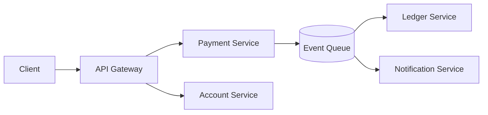
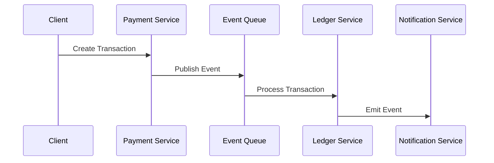

# RFC-003: AEGIS Service Boundaries & Domain Design

**Status: Accepted**

**Author: Chirag Venkateshaiah**

Related RFCs: 
- RFC-001 Distributed Platform Architecture
- RFC-002 Event Driven Processing Model

---

## 1. Purpose

The RFC defines the service boundaries and domain model of the AEGIS platform.

It establishes how the system is decomposed into independently deployable services, each aligned with a specific business capability and data ownership model

---

## 2. Scope

This RFC covers:

- domain-driven service decomposition
- service responsibilities and ownership
- data ownership boundaries
- inter-service communication patterns
- architectural constraints and anti-patterns

---

## 3. Design Principles

### 3.1 Domain-Oriented Design

Service are defined around **business capabilities**, not infrastructure layers.


### 3.2 Single Responsibility per Service

Each service owns:

- one domain
- one data model
- one responsibilites boundary

### 3.3 Strict Data Ownership
- Each service owns its database
- No direct cross-service database access
- All communication via APIs or events

### 3.4 Loose Coupling
- asynchronous communication preferred
- synchronous communication limited to queries

### 3.5 System of Record Isolation

Critical domains (e.g., Ledger) must be:
- isolated
- strongly consistent
- protected from external writes


---

## 4. High-Level Service Architecture



## 5. Core Domain Service

AEGIS is divided into the following core domains:

### 5.1 Payment Service

#### Responsibility
- accept transaction requests
- validate input
- enforce idempotency
- publish transaction events

#### Owns
- transaction requests
- idempotency keys

#### Constraints
- must not modify ledger directly

### 5.2 Account Service

#### Responsibility

- manage account lifecycle
- provide account metadata

#### Owns

- account profiles
- account state (non-financial)

### 5.3 Ledger Service (Critical Domain)

#### Responsibility
- maintain financial correctness
- update balances
- store transaction history

#### Owns
- ledger entries
- account balances

#### Constraints
- strongly consistent
- idempotent
- append-only ledger model

### 5.4 Notification Service

#### Responsibility
- deliver transaction notifications
- handle retries and delivery status

#### Owns
- notification state
- delivery logs

---

## 6. Domain Interaction Model


---

## 7. Communication Patterns
| Pattern      | Usage             |
| ------------ | ----------------- |
| Event-driven | state changes     |
| API          | queries / lookups |

#### Rule
- Events = source of truth for state transitions
- APIs = read access only

---

## 8. Data Ownership Model

Each service owns its own datastore.

| Service              | Data Owned           |
| -------------------- | -------------------- |
| Payment Service      | transaction requests |
| Account Service      | account metadata     |
| Ledger Service       | balances, ledger     |
| Notification Service | notifications        |

### Rule: No Shared Database

This is critical.

- No cross-service DB access
- No shared schema

> All communication via events/APIs

---

## 9. Service Contracts

Each service exposes:

### API Contracts
- REST/gRPC interfaces for queries

### Event Contracts
- well-defined event schemas
- versioned contracts

---

## 10. Service Boundaries Rationale

Why this decomposition?

### Payment vs Ledger separation

- prevents double writes
- isolates financial correctness

### Ledger isolation

- single source of truth
- protects financial correctness

---

## 11. Anti-Pattern Avoided

### Distributed Monolith

Symptoms:

- shared DB
- tightly coupled services

### God Service

Avoid:

- one service doing everything

### Synchronous Chains

Avoid:

```bash
API → Service A → Service B → Service C
```
Leads to:

- cascading failures
- latency amplification

---

## 12. Scaling Model

Each service scales independently:

| Service         | Scaling Strategy   |
| --------------- | ------------------ |
| Payment         | API scaling        |
| Ledger          | controlled scaling |
| Worker Services | horizontal scaling |
| Notification    | burst scaling      |

## 13. Failure Isolation

Failures are contained:

- Payment failure ➡ no ledger corruption
- Notification failure ➡ no transaction loss
- Worker failure ➡ retriable

## 14. Consistency Model Across Domains

| Domain | Consistency |
| ------ | ----------- |
| Ledger | Strong      |
| Others | Eventual    |

## 15. Security Boundaries

Each service enforces:
- authentication
- authorization
- service-level access control

---

## 16. Evolution Strategy

Future service may include:
- Fraud Detection Service
- Audit Service
- Analytics Pipeline

## 17. Decision

AEGIS adopts a domain-driven microservices architecture with strict service boundaries and event-driven communication.

## 18. Consequences

### Pros

- clear ownership
- scalable architecture
- fault isolation

### Cons

- increased operational complexity
- distributed debugging challenges

---

## 19. Future Work

- API specifications
- schema registry
- service SLAs
- domain event catalog

