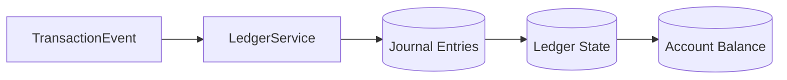
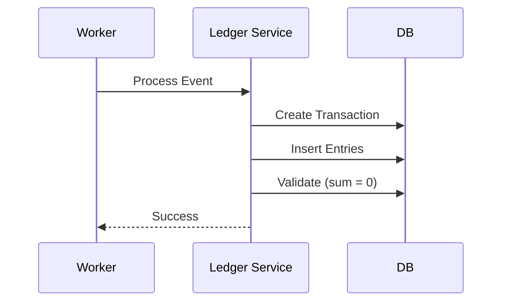

# RFC-004: AEGIS Ledger & Data Model (Double Entry System)

**Status: Draft**

**Author: Chirag Venkateshaiah**

Related RFCs: 
- RFC-001 Distributed Platform Architecture
- RFC-002 Event Driven Processing Model
- RFC-003 Service Boundaries & Domain Design

---

## 1. Purpose

This RFC defines the **financial ledger model and data structure** used by the AEGIS platform.

It establishes how transactions are recorded, how balances are derived, and how the **system ensures financial correctness through double-entry accounting.**

---

## 2. Scope

This RFC defines:
- ledger data model
- double-entry accounting system
- transaction representation
- balance computation
- idempotency and consistency guarantees

---

## 3. Design Goals

### Financial Correctness
No money should be created or lost.

### Auditability
All transactions must be traceable.

### Idempotency
Duplicate processing must not corrupt balances.

### Consistency
Ledger must always remain valid.

---

## 4. Ledger Architecture Overview



---

## 5. Core Concepts

### 5.1 Account
Represent an entity holding value.

Examples:
- user account
- system account
- settlement account

### 5.2 Transaction
A logical financial operation.

Example:
- transfer $100 from A -> B

### 5.3 Entry (Journal Entry)
Represents a single debit or credit.

Each transaction consists of **multiple entries.**

### 5.4 Ledger
The complete history of all entriies.

---

## 6. Double Entry Model
Every transaction must satisfy:

```bash
Total Debits = Total Credits
```

### Example
Transfer $100 from Account A -> B:

| Account | Type   | Amount |
| ------- | ------ | ------ |
| A       | Debit  | -100   |
| B       | Credit | +100   |

### Invariant

```bash
Sum(entries) = 0
```

This ensures:
- No money creation
- No money loss

---

## 7. Data Model

### 7.1 Accounts Table

```sql
accounts (
  account_id UUID PRIMARY KEY,
  account_type TEXT,
  created_at TIMESTAMP
)
```

### 7.2 Transaction Table

```sql
transactions (
  transaction_id UUID PRIMARY KEY,
  reference_id TEXT,
  created_at TIMESTAMP
)
```

### 7.3 Ledger Entries Table

```sql
ledger_entries (
  entry_id UUID PRIMARY KEY,
  transaction_id UUID,
  account_id UUID,
  amount NUMERIC,
  entry_type TEXT, -- debit / credit
  created_at TIMESTAMP
)
```

---

## 8. Transaction Processing Flow


---

## 9. Balance Computation
Balance is derived as:

```bash
Balance = SUM(all ledger entries for account)
```

### Optimization

Maintain:

```bash
materialized balance table
```

But

Source of truth = ledger entries

---

## 10. Idempotency

To prevent duplicate processing:
- unique transaction_id enforced
- duplicate insert rejected

---

## 11. Consistency Guarantees

Ledger Service enforces:
- atomic transaction writes
- all entries committed together
- no partial updates

---

## 12. Concurrency Control

Handled via:
- database transactions
- row-level locking
- optimistic concurrency

---

## 13. Failure Handling

| Failure               | Handling    |
| --------------------- | ----------- |
| Duplicate transaction | ignored     |
| partial write         | rolled back |
| invalid entries       | rejected    |

---

## 14. Auditability

System gurantees:
- immutable ledger
- append-only entries
- full traceability

---

## 15. Invariants

The system must always satisfy:
1. Sum of entries = 0
2. No orphan transactions
3. No duplicate transaction_id
4. Ledger is append_only

---

## 16. Anti-Patterns Avoided

### Single-entry accounting
- leads to inconsistency

### Updating balances directly
- breaks auditability

### Deleting transactions
- breaks history

---

## 17. Security Considerations

- restricted write access to ledger
- validation of all transaction inputs
- audit logs

---

## 18. Decision

AEGIS adopts a **double-entry, append-only ledger model** as the system of record.

---

## 19. Consequences

### Pros

- strong financial correctness
- auditability
- deterministic state


### Cons

- higher complexity
- slower writes vs simple models

---

## 20. Future Work

- multi-currency support
- reconciliation systems
- external settlement integration
- ledger sharding

