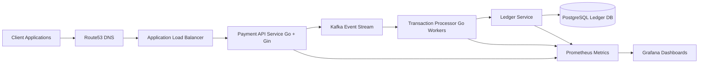

# Container Diagram (C4 Level 2)



## What Each Container Represents

#### Payment API

Handles:

- payment requests
- validation
- authentication

Publishes events to Kafka.

---

#### Kafka Event Stream

Responsible for:

- decoupling API and workers
- buffering transactions
- enabling event replay


#### Transaction Processor

Consumes events and:

- validates transactions
- processes payments
- updates ledger


#### Ledger Services

Responsible for:

- account balances
- transaction recording
- financial consistency


#### PostgreSQL Ledger DB

Stores:

```bash
accounts
transactions
ledger_entries
```

#### Observability Stack

Prometheus collects:

```bash
API latency
transaction throughput
queue depth
error rates
```

Grafana visualizes dashboards.


