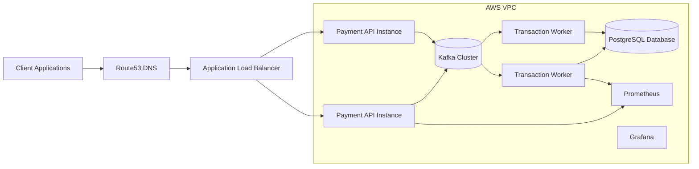

# AEGIS Deployment Architecture

This diagram shows how the AEGIS platform components are deployed within a cloud infrastructure environment.

## Infrastructure Components

- Route53 DNS
- Application Load Balancer
- Payment API instances
- Transaction worker instances
- Kafka cluster
- PostgreSQL database
- Prometheus monitoring
- Grafana dashboards

## Diagram

## Infrastructure Behavior

- Load balancer distributes API traffic.
- APIs publish transaction events to Kafka.
- Workers consume events from Kafka.
- Workers update the ledger database.
- Prometheus collects metrics.
- Grafana visualizes system dashboards.

