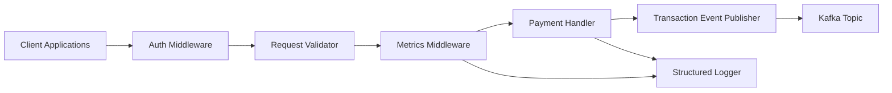

# C4 Level 3 -- Component Diagram (Payment API)

This diagram breaks down the **Payment API service internally.**



## Components Explained

#### Auth Middleware

Responsible for:

- API authentication
- token validation
- access control


#### Request Validator

Validates:

- payment amount
- currency
- account IDs

Rejects invalid requests early.


#### Metrics Middleware

Records:

```bash
http_request_duration_seconds
payment_requests_total
payment_failures_total
```

These are scraped by **Prometheus.**


#### Payment Handler

Core API logic:

- create transaction ID
- prepare event message
- call Kafka publisher


#### Transaction Event Publisher

Publishes events:

```bash
transaction.created
```
to Kafka.


#### Structure Logger

Provides:

```bash
request_id
transaction_id
status
latency
```

This allows log correlation

