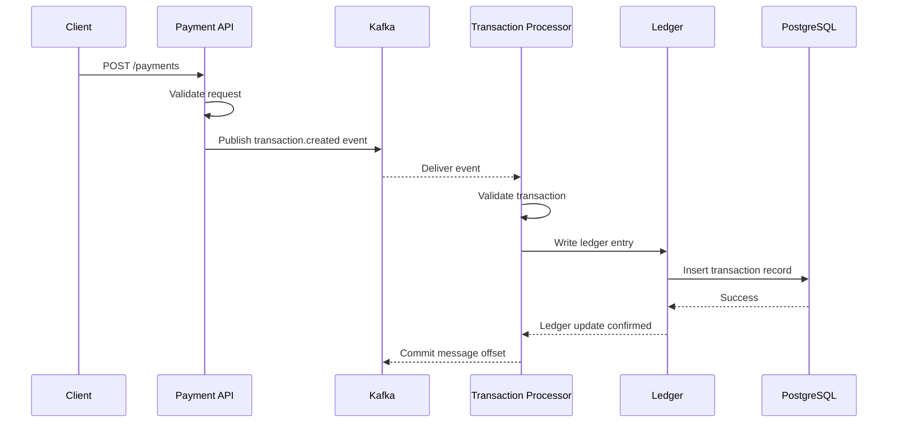

# Payment Processing -- Sequence Diagram

This sequence diagram illustrates the lifecycle of a payment request through the AEGIS system.

## Diagram

## Flow Explanation

1. Client sends payment request.
2. Payment API validates request.
3. API publishes event to Kafka.
4. Transaction processor consumes event.
5. Processor validates transaction.
6. Ledger service writes entry to database.
7. Database confirms persistence.
8. Worker commits message offset.

