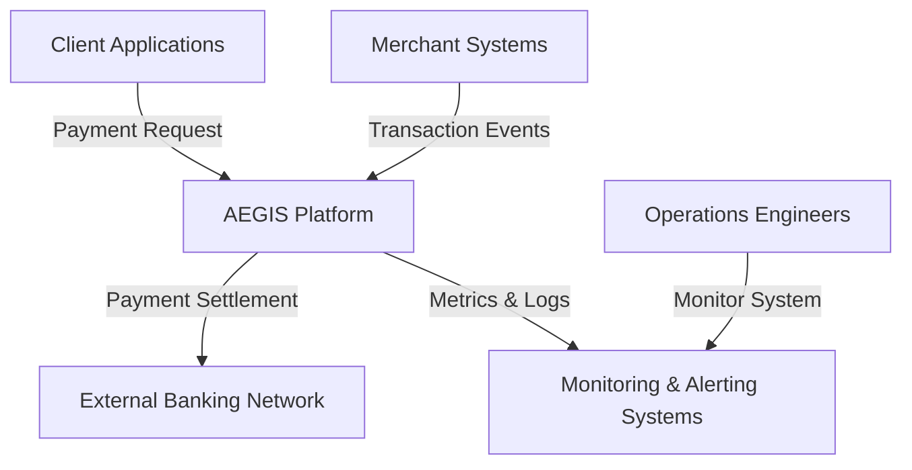

# System Context Diagram (C4 Level 1)

## What this communicates

This diagram explains in one glance:

Actors:

- Client Applications
- Merchant Systems
- Operations Engineers

External systems:

- Banking Network
- Monitoring Systems

Core system:

- AEGIS Platform
