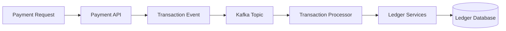

# Transaction Data Flow

This diagram illustrates the lifecycle of transaction data within the AEGIS platform.

## Diagram

## Flow Description

1. Client sends a payment request.
2. Payment API converts the request into a transaction event.
3. The event is published to Kafka
4. A transaction processor consumes the event.
5. Processor validates and processes the transaction.
6. Ledger service records the transaction.
7. The database stores the ledger entry.

