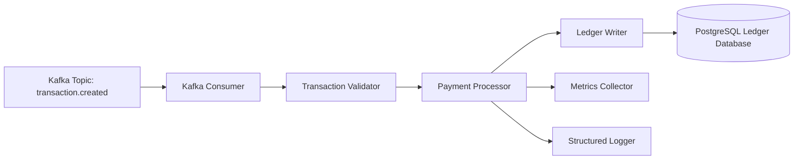

# Transaction Processor -- Component Diagram

This diagram shows the internal components of the **Transaction Processor** service.

The processor consumes transaction events from Kafka and updates the ledger system.

### Components

- Kafka Consumer
- Transaction Validator
- Payment Processor
- Ledger Writer
- Metrics Collector
- Structured Logger

### Diagram

### Responsible

#### Kafka Consumer

Consumes event from the Kafka transaction topic.

#### Transaction Validator

Validates transaction integrity such as:

- account existence
- sufficient balance
- fraud checks

#### Payment Processor

Executes the core transaction logic and prepares ledger updates.

#### Ledger Writer

Writes ledger entries to the PostgreSQL database.

#### Metrics Collector

Exports processing metrics such as:

- transaction_processed_total
- worker_latency_seconds
- worker_faiures_total

#### Structured Logger

Captures logs with transaction identifiers and processing results.

