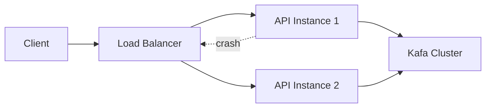

# API Instance Failover

This diagram shows how the AEGIS platform handles Payment API instance failures.

Multiple API instances run behind a load balancer.

## Diagram

## Resilience Strategy

The load balancer distributes traffic across API instances.

if one instance fails:

1. Health checks detect failure.
2. Load balancer removes the instance.
3. Traffic is routed to remaining instances.

## Reliability Features

- Horizontal scaling
- Health checks
- Automatic traffic rerouting

