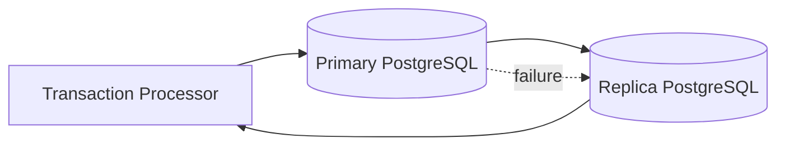

# Database Failover

This diagram illustrates how the AEGIS platform handles database failure.

PostgreSQL replication provides failover capability.

## Diagram

## Resilience Strategy

The database uses a **primary-replica architecture.**

If the primary database fails:

1. Replica is promoted to primary.
2. Application reconnects to new primary.
3. Transaction processing resumes.

## Relabillity Features

- Streaming replication
- Automatic failover
- Data durability