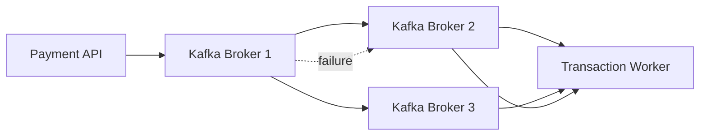

# Kafka Broker Failure Handling

This diagram illustrates how the AEGIS platform maintains availability when a Kafka broker fails.

Kafka topics are replicated across multiple brokers. if one broker fails, leadership is transferred to another replica.

## Diagram

## Resilience Strategy

Kafka maintains replicated partitions across brokers.

### When Broker 1 fails:

1. A replica broker becomes the new leader.
2. Producers automatically redirect to the new leader.
3. Consumers continue processing messages.

## Reliability Features

- Partition replication
- Leader election
- Durable message storage
