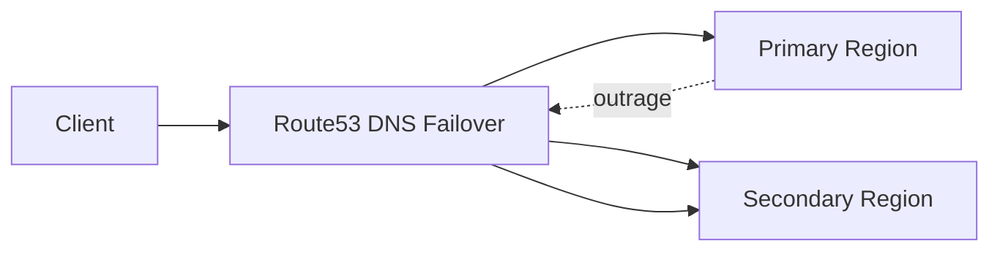

# Multi-Region Failover

This diagram illustrates how AEGIS maintains availability during regional outrages.

Traffic can be redirected to a secondary region.

## Diagram

## Resilience Strategy

Route53 performs DNS-based failover

If the primary region becomes unavailable:

1. Health checks fail.
2. DNS redirects traffic to secondary region.
3. Platform continues operating.

## Reliability Features

- Regional redundancy
- DNS failover
- Diaster recovery capability

