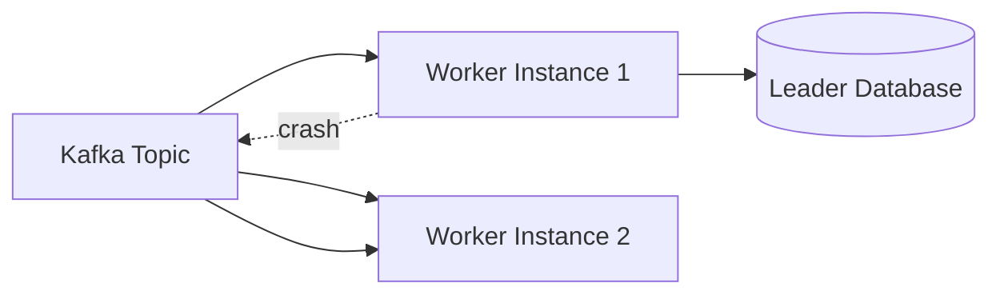

# Worker Crash Recovery

This diagram shows how the AEGIS platform handles transaction worker crashes. Kafka ensures that unprocessed messages remain available for other workers.

## Diagram

## Resilience Strategy

Workers process messages from Kafka

If a worker crashes:

1. Kafka retains the message.
2. The offset is not committed.
3. Another worker consumes the message.

## Resilience Features

- Message durability
- Consumer group rebalancing
- Offset-based processing