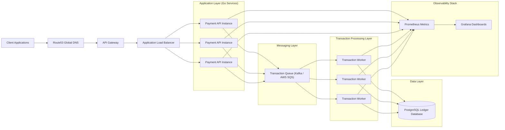

# 🛡 AEGIS — Platfrom Architecture Document

Version: **1.0**
Status: **Accepted (Baseline Architecture)**
Date: **2026-03-13**


---

## 1. Introduction

### 1.1 Purpose

This document defines the **baseline architecure** of the **AEGIS platform.** It describes the high-level system structure, core components, technology choices, and operational principles.

The goal of this architecture is to simulate a **production-style distributed cloud platform** that demonstrates:

- event-driven system design
- multi-region infrastructure
- asynchronous transaction processing
- observability-first engineering
- infrastructure-as-code deployment

This architecture represents the **initial stable design (~70%)** of the system.

Future architecture decisions will be documented using **Architecture Decision Records (ADR).**

---

### 1.2 System Overview

AEGIS is a distributed payment processing simulation platform designed to model how modern cloud platforms handle transactional workloads across multiple regions.

The platform processes payment requests using an **asynchronous event-driven architecture.**

Instead of processing transactions synchronously, the system publishes transaction events to a messaging system. Worker services consume these events and update a replicated ledger database.

This design improves:

- scalability
- fault isolation
- system resilience
- operational observability

---

## 2. Architectural Principles

The architecture of AEGIS follows several key engineering principles.

### Event-Driven Architecture

Transaction processing is performed asynchronously through message queues to decouple services and enable scalable processing.

### Service Decoupling

Application services communicate through messaging infrastructure rather than direct synchronous dependencies.

### Observability First

The platform integrates metrics and monitoring capabilities to support operational visibility and reliability engineering.

### Infrastructure as Code

Infrastructure provisioning is managed using Terraform to ensure reproducibility and consistency across environments.

### Multi-Region Resilience

The system supports deployment across multiple regions to simulate real-world disaster recovery and high availability strategies.

---

## 3. Non-Functional Requirements

Non-functional requirements define the operational characteristics of the AEGIS platform. These requirements guide architectural decisions related to scalability, reliability, and performance.

---

### 3.1 Availability Goals

AEGIS is designed to simulate a **high-availability distributed platform.**

Target availability:

```text
99.9% service availability
```

This corresponds to approximately:

| Availability | Maximum Downtime / Month |
| ------------ | ------------------------ |
| 99.9%        | ~43 minutes              |


High avilability is achieved through:

- multi-region deployment
- redundant API instances behind a load balancer
- asynchronous processing via messaging queues
- database replication across regions


---

### 3.2 Latency Targets (SLO)

Because transaction processing in asynchronous, the system defines separate latency targets for **API response time** and **transaction completion time.**

#### API Response Latency

Target:

```text
p95 < 200 ms
```
This includes:

- request validation
- transaction ID creation
- event publication to the queue

The API does not wait for full transaction processing.


#### Transaction Processing Latency

Target:

```text
p95 < 5 seconds
```

This measures the time from:

```text
transaction event creation → ledger database update
```

Latency depends on:

- queue backlog
- worker processing rate
- database performance

---

### 3.3 Scalability Requirements

AEGIS is designed to support **horizontal scaling of services.**

#### API Layer Scaling

Payment API instances can scale horizontally behind the **Application Load Balancer.**

Example scaling model:

```bash
Load Balancer
├── Payment API Instance
├── Payment API Instance
└── Payment API Instance
```

New instances can be added to handle increased traffic.

 
#### Worker Layer Scaling

Transaction workers scale independently of the API layer.

Workers consume events from the messaging queue.

Scaling is achieved by increasing worker instances:

```bash
Queue
├── Worker
├── Worker
├── Worker
└── Worker
```

This architecture allows the platform to absorb bursts of traffic without overwhelming the system.

---

### 3.4 Throughput Targets

Initial target throughput for the platform:

```text
 1000 transactions per minute
```

The event-driven architecture allows throughput to scale as worker capacity increases.

Throughput is primarily constrained by:

- queue processing capacity
- worker compute resources
- database write throughput

---

### 3.5 Reliability Requirements

The platform must tolerate the following failure scenarios:

#### API Instances Failure
The load balancer automatically routes traffic to healthy API instances.

#### Worker Failure
Unacknowledged queue messages will be reprocessed by other workers.

#### Queue Backlog
Queues absorb traffic spikes and allow workers to process events at sustainable rates.

#### Regional Failure
Route53 can redirect traffic to alternate regions.

---

### 3.6 Observability Requirements

The platform must provide visibility into system behavior.

Metrics collected include:

- API request latency
- queue depth
- worker throughput
- transaction failure rate
- database write latency

Prometheus collects metrics from services, and Grafana dashboards visualize system performance.

These metrics enable operators to detect:

- traffic spikes
- processing bottlenecks
- service failures

---

### 3.7 Cost Efficiency

The platform is designed to be deployable within **AWS Free Tier or low-cost infrastructure environments** during development.

Strategies include:

- containerized services
- lighweight compute instances
- local development using Docker
- optional use of managed AWS services for production simulations


---


## 4. System Constraints & Assumptions

This section documents the **technical, operational, and environmental constraints** under which the AEGIS platform is designed and implemented.

These constraints influence architecture decisions, infrastructure selection, and system scalability.


### 4.1 Infrastructure Constraints

The AEGIS platform is designed primarily for learning, simulation, and experimentation rather than production financial processing.

Therefore, infrastructure choices are constrained by:

- cost efficiency
- developer accessibility
- ability to run locally

The system should be deployable using:

```text
AWS Free Tier
Local Docker environments
Low-cost cloud infrastructure
```

This allows developers to run the entire platform locally without requiring expensive infrastructure.


### 4.2 Cloud Provider Assumption

The initial implementation of AEGIS assumes **AWS as the primary cloud provider.**

Key AWS services expected to be used include:

| Service                   | Purpose              |
| ------------------------- | -------------------- |
| Route53                   | Global DNS routing   |
| API Gateway               | API entry point      |
| Application Load Balancer | Traffic distribution |
| EC2 / ECS                 | Application compute  |
| SQS (optional)            | Messaging system     |
| RDS / PostgreSQL          | Ledger database      |

The architecture is designed to remain cloud-agnostic where possible, allowing future portability to other cloud providers.


### 4.3 Messaging Infrastructure Assumption

The system assumes the presence of a durable messaging system that guarantees delivery of transaction events.

Possible implementation include:

- Apache Kafka (local development)
- AWS SQS (cloud deployment)


The messaging system must support:

- message durability
- event ordering (where applicable)
- retry mechanisms
- horizontal scalability


### 4.4 Development Environment Assumption

The platform assumes that developers can run the system locally using containerized services.

Local development environments are expected to run:

- Payment API service
- Transaction worker service
- PostgreSQL database
- Kafka (or equivalent queue)
- Prometheus
- Grafana

These services will be orchestrated using **Docker containers.**


### 4.5 Traffic Simulation Assumption

AEGIS is designed as a **simulation platform** rather than a live payment processor.


Transaction traffic will typically be generated through:

- synthetic traffic generators
- load testing tools
- simulation scripts


This allows testing of:

- queue backpressure
- worker scaling
- failure recovery
- system observability


### 4.6 Security Scope Assumption

Security features implemented in AEGIS will focus on **core architectural practices**, rather than full financial compliance.

The system may include:

- API authentication
- request validation
- secure communication (HTTPS)

However, advanced compliance requirements such as **PCI-DSS certification** are outside the scope of this project.


### 4.7 Data Persistence Assumption

The system assumes that the ledger database provides:

- strong consistency for financial records
- durable storage
- transactional integrity

PostgreSQL is chosen due to its reliability and strong support for transactional workloads.

Ledger records will follow an **append-only model** to preserve historical transaction integrity.


### 4.8 Observability Infrastructure Assumption

The platform assumes the availability of a monitoring stack capable of collecting and visualizing system metrics.


The monitoring stack includes:

- Prometheus for metrics collection
- Grafana for visualization dashboards

These tools will provide operational insights into system performance, latency, and reliability.


---


## 5. High-Level System Architecture


---

### High-Level Flow Diagram

```text
Client
   │
Route53 DNS
   │
API Gateway
   │
Application Load Balancer
   │
Payment API Cluster (Go)
   │
Transaction Queue (Kafka / SQS)
   │
Transaction Worker Cluster (Go)
   │
PostgreSQL Ledger Database
```

The Application Load Balancer distributes traffic across multiple instances of the Payment API, enabling horizontal scaling and improved fault tolerance.

---

### Component Responsibilities

| Component                 | Responsibility                                      |
| ------------------------- | --------------------------------------------------- |
| Client                    | Sends payment requests                              |
| DNS                       | Global traffic routing                              |
| API Gateway               | Entry point for API requests                        |
| Application Load Balancer | Distributes traffic across API instances            |
| Payment API               | Validates requests and publishes transaction events |
| Transaction Queue         | Buffers and distributes transaction events          |
| Transaction Workers       | Processes transaction events                        |
| Ledger Database           | Stores immutable transaction records                |

---

## 6. Transaction Processing Flow

The system processes transactions asynchronously.

#### Request Flow

1. Client submits a payment request.
2. DNS routes traffic to the nearest region.
3. API Gateway receives the request.
4. The Application Load Balancer distributes the request to a Payment API instance.
5. Payment API validates the request and creates a transaction ID.
6. A transaction event is published to the messaging system.
7. Transaction workers consume events from the queue.
8. Workers write ledger entries to the database.

#### Sequence Overview

```text
Client
  │
API Gateway
  │
Application Load Balancer
  │
Payment API
  │
Transaction Queue
  │
Transaction Worker
  │
Ledger Database
```

This architecture ensures that API requests remain lightweight while processing is handled asynchronously by worker services.

---

## 7. Multi-Region Infrastructure Design

AEGIS simulates a **multi-region deployment model.**

Two regions are deployed:

- **Primary Region**
- **Secondary Region**

Each region runs application services independently.

```bash
                 Route53 DNS
                       │
        ┌──────────────┴──────────────┐
        │                             │
   Region A                      Region B
   (Primary)                     (Secondary)

 Load Balancer                Load Balancer
 Payment API                  Payment API
 Workers                      Workers
 Ledger DB (Primary)          Ledger DB (Replica)
 ```

#### Regional Characteristics

| Region           | Purpose                   |
| ---------------- | ------------------------- |
| Primary Region   | Main write region         |
| Secondary Region | Failover and read replica |

---

## 8. Observability Architecture

Observability is an essential part of the platform design.

The system uses the following monitoring stack:

| Tool       | Purpose                  |
| ---------- | ------------------------ |
| Prometheus | Metrics collection       |
| Grafana    | Visualization dashboards |


#### Metrics Collected

Example metrics include:

- API request latency
- transaction throughput
- worker processing rate
- queue backlog
- transaction failure rate

Services expose metrics endpoints which are scraped by Prometheus.

Grafana dashboards provide operational visibility into system performance.

---

## 9. Technology Stack

The AEGIS platform uses the following technology stack.

| Layer                  | Technology                    |
| ---------------------- | ----------------------------- |
| Programming Language   | Go                            |
| API Framework          | Gin                           |
| Messaging System       | Apache Kafka / AWS SQS        |
| Database               | PostgreSQL                    |
| Metrics                | Prometheus                    |
| Monitoring Dashboards  | Grafana                       |
| Infrastructure as Code | Terraform                     |
| Containerization       | Docker                        |
| Cloud Platform         | AWS                           |
| Load Balancing         | AWS Application Load Balancer |


These technologies were selected to reflect **tools community used in modern infrastructure and platform engineering environments.**

---

## 10. Infrastructure Architecture

Infrastructure resources are provisioned using **Terraform.**

The infrastructure layer manages:

- network configuration
- compute resources
- load balancers
- container deployment
- database provisioning
- security groups and routing

Docker containers are used to package application services for consistent deployment.

---

## 11. Architecture Diagrams

[System Context Diagram](/diagrams/aegis-system-context.md)

[Container Diagram](/diagrams/aegis-container-diagram.md)


## 11. Data Model Overview

The system uses a **ledger-based storage model.**

Primary tables include:

#### Transactions

```text
transaction_id
user_id
amount
currency
timestamp
status
```

#### Accounts

```text
account_id
user_id
balance
```

#### Ledger Entries

```text
entry_id
transaction_id
from_account
to_account
amount
timestamp
```

Ledger entries are **append-only** to preserve financial auditability.

---

## 12. Failure Handling Strategy

The system is designed to tolerate several failure scenarios.

#### Queue Backpressure

> Message queues absorb spikes in transaction traffic.


#### Worker Failures

> Workers can restart and reprocess unacknowledge events.


#### API Instance Failures

> The load balancer routes traffic only to healthy API instances.


#### Regional Failures

> Traffic can be redirected by DNS to alternate regions


#### Database Replication

> Replica databases allow system recovery if the primary region fails.


---

## 13. Risk Analysis & Trade-offs

This section documents potential architectural risks, design trade-offs, and mitigation strategies associated with the AEGIS platform architecture.

Understanding these trade-offs ensures that future engineers working on the platform can evaluate the impact of architectural decisions.


### 13.1 Asynchronous Processing Trade-off

AEGIS processes transactions using an **asynchronous event-driven architecture.**

#### Benefits

- Improved API reponsiveness
- Better scalability under high traffic
- Decoupled services
- Ability to absorb traffic spikes via queue buffering

#### Risks

Asynchronous processing introduces **eventual consistency**

This means that after a transaction request is accepted:

```text
API response may occur before transaction processing completes
```

Clients may temporarily observe inconsistent state.


#### Mitigation

- Transaction status endpoints can be used to query processing results.
- Monitoring tools track queue backlog and worker processing rates.


### 13.2 Messaging Infrastructure Trade-off

AEGIS supports two possible messaging implementations:

-  Apache Kafka (local development)
- AWS SQS (cloud deployment)


#### Kafka Benefits

- high throughput event streaming
- persistent event logs
- strong ecosystem support


#### Kafka Risks

- operational complexity
- cluster management overhead


#### SQS Benefits

- managed cloud services
- simpler operational model
- integrated with AWS infrastructure


#### SQS Risks

- vendor dependency
- limited event streaming capabilities compared to Kafka


#### Mitigation

The system architecture abstracts the messaging layer so that the queue implementation can be replaced without major application redesign.


### 13.3 Multi-Region Deployment Trade-off

AEGIS supports a multi-region architecture to simulate high availability.


#### Benefits

- improved resilience against regional outrages
- failover capability
- distributed traffic handling


#### Risks
Multi-region systems introduce additional complexity:

- data replication latency
- increased infrastructure costs
- more complex deployment pipelines


#### Mitigation

The architecture uses a **primary write region with replica databases** to simplify data consistency management.


### 13.4 Horizontal Scaling Complexity

Horizontal scaling improves system capacity but introduces operational challenges.

#### Benefits

- scalable API layer
- scalable worker processing
- improved fault tolerance


#### Risks

More instances increase:

- deployment complexity
- monitoring requirements
- resource management overhead


#### Mitigation

Load balancers distribute traffic automatically and observability tools provide visibility into system performance.


### 13.5 Database Consistency Trade-off

Financial systems require strong consistency for ledger records.

AEGIS uses PostreSQL with **transactional guarantees** to maintain ledger integrity.


#### Benefits

- reliable transactional behavior
- strong consistency for financial data
- mature database ecosystem


#### Risks

Traditional relational databases may become bottlenecks under extremely high write throughput.


#### Mitigation

Future architecture iterations may consider:

- read replicas
- partitioning strategies
- sharing approaches


### 13.6 Observability Overhead

Observability tools such as Prometheus and Grafana provide valuable operational insights.


#### Benefits

- real-time system visibility
- easier debugging and incident response
- performance monitoring


#### Risks

Observability systems introduce:

- additional infrastructure components
- resource consumption for metrics collection


#### Mitigation

Metrics collection intervals and storage policies will be tuned to balance visibility and infrastructure overhead.


### 13.7 Infrastructure Cost Trade-off

The architecture is designed with **cost efficiency** in mind for development environments.


#### Benefits

- ability to run locally with Docker
- use of AWS Free Tier resources
- low operational cost during development


#### Risks

Free-tier infrastructure may not accurately simulate large-scale production workloads.


#### Mitigation

Load testing and traffic simulation tools can be used to approximate higher-scale scenarios.


---


## 14. Architecture Governance

This architecture document defines the **baseline system design.**

Changes to architecture decisions must be recorded using **Architecture Decision Records (ADR).**

Examples of ADR topics include:

- messaging system selection
- database replication strategy
- infrastructure platform changes
- observability tooling

ADR documents provide historical context for why architectural decisions were made.

---

## 15. Future Enhancements

Future iterations of AEGIS may include:

- distributed tracing (OpenTelemetry)
- automated failover simulation
- chaos engineering experiments
- load testing infrastructure
- automated scaling strategies

These enhancements will be documented through additional ADRs.


---

## 16. Conclusion

AEGIS is designed as a **cloud-native distributed platform simulation that demonstrates key platform engineering concepts

The architecture emphasizes:

- asynchronous processing
- multi-region reliability
- observability
- infrastructure automation

This document establishes the **initial architecture baseline** from which the platform wil evolve.

