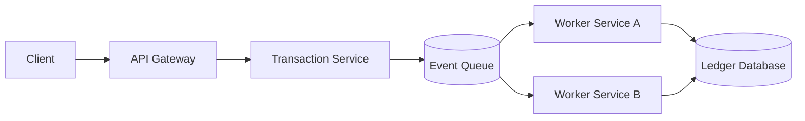
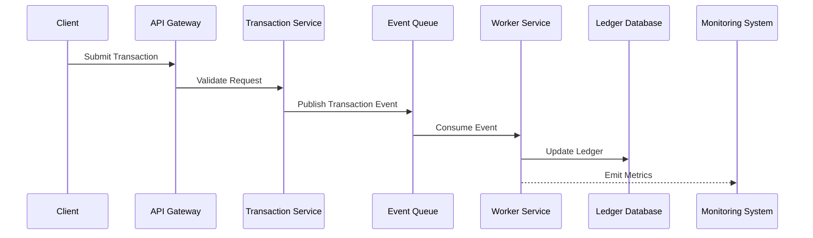

# RFC-001: AEGIS Distributed Platform Architecture

**Status: Accepted**

**Author: Chirag Venkateshaiah**

---

## 1. Purpose

This RFC defines the **high-level distributed architecture** of the AEGIS platform.

The architecture establishes the foundational structure for building a scalable, reliable and observable financial transaction processing platform.

---

## 2. Scope

This RFC covers:

- system architecture
- service boundaries
- communication patterns
- data flow
- architectural principles

This RFC does not define specific technology implementation, which will be covered in later RFCs.

---

## 3. Architectural Principles

The architecture follows three primary distributed systems principles:

### Reliability
The platform must tolerate failures without losing financial transaction data.

### Scalability
The system must scale horizontally to support increasing transaction load.

### Maintainability
The architecture should allow independent service evolution and observability.

---

## 4. System Overview

AEGIS is an **event-driven distributed platform** designed to process financial transactions asynchronously.

The platform decomposes the transaction workflow into multiple services connected through an event queue.

This design allows independent scaling of components and isolates system failures.

---

## 5. High-Level Architecture

### 5.1 Transition Processing Flow

## 6. Component Responsibilities

### API Gateway

Responsibilities:

- authentication
- request routing
- rate limiting

### Transaction Service

Responsibilities:

- validate transaction requests
- publish transaction events
- enforce idempotency

### Event Queue

Responsibilities:

- asynchronous event delivery
- buffering of transaction load
- decoupling of services

### Worker Services

Responsibilities:

- transaction processing
- ledger updates
- business rule execution

Workers consume events from the queue and perform processing tasks.

### Ledger Database

Responsibilities:

- durable storage of financial transactions
- account balances
- audit trail

## 7. Communication Model

All service-to-service communication is **asynchronous** using event messaging.

Benefits:

- service decoupling
- load buffering
- resilience to partial system failures

## 8. Observability Considerations

The architecture must support:

- metrics collection
- centralized logging
- distributed tracing

Observability enables monitoring of:

- transaction throughput
- processing latency
- queue depth
- worker failures

## 9. Fault Isolation

Failures in individual components should not cascade across the platform.

Examples:

- worker failure should not affect API availability
- queue backlog should not cause system crashes
- database failures should be detectable and recoverable

## 10. Alternatives Considered

### Monolithic Architecture

Rejected due to:

- limited scalability
- tighter coupling
- harder operational isolation

### Synchronous Microservices

Rejected due to:

- cascading failures
- increased latency
- reduced fault tolerance

## 11. Decision

AEGIS will adopt a **distributed event-driven architecture** with asynchronous service communication

## 12. Consequences

### Pros
- horizontal scalability
- improved fault isolation
- independent service scaling
- improved resilience

### Cons
- increased operational complexity
- additional observability requirements
- eventual consistency challenges

## 13. Future Evolution

Future RFCs will define:

- technology stack
- deployment architecture
- observability stack
- data model
