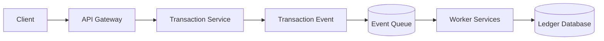
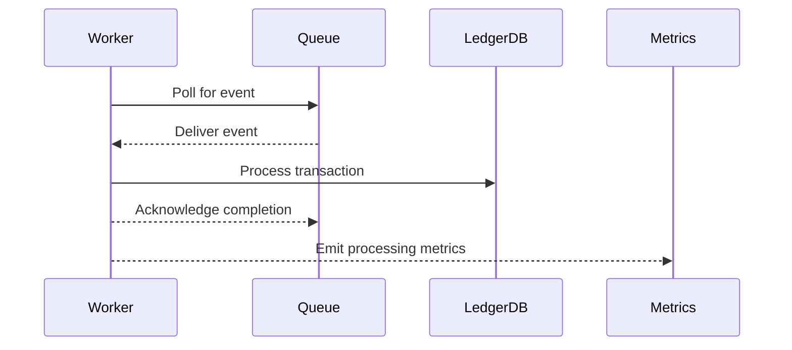

# RFC-002: AEGIS Event Driven Processing Model

**Status: Draft**
**Author: Chirag Venkateshaiah**
**Related RFC: RFC-001 Distributed Platform Architecture**

---

## 1. Purpose

This RFC defines the **event-driven processing model** used by the AEGIS platform.

It establishes how services communicate using events, how transaction processing flows through the system, and how reliability concerns such as retries, idempotency, and failure handling are addressed.

---

## 2. Scope

This RFC covers:

- event communication model
- event lifecycle
- event schema structure
- worker processing model
- retry and failure handling
- idempotency guarantees

This RFC does **not define specific messaging technologies**, which will be addressed in later infrastructure RFCs.

---

## 3. Design Goals

The event-driven system must satisfy the following requirements.

### Reliability

Events representing financial transactions must not be lost.

### Scalability

The event pipeline must support horizontal scaling of workers.

### Decoupling

Services must remain loosely coupled through asynchronous communication.

## Fault Tolerance

The system must continue processing transactions even when individual services fail.

---

## 4. Event Driven Architecture Overview

In AEGIS, the **transaction service publishes events representing financial actions.**
Worker services asynchronously consume these events and perform processing tasks.

This architecture separates transaction ingestion from processing, allowing the system to absorb bursts of traffic while maintaining reliability.

---

## 5. Event Flow



---

## 6. Event Lifecycle

An event moves through the following lifecycle stages.

### 1. Creation

A transaction request is validated by the transaction service.

### 2. Publication

The service publishes a transaction event to the event queue.

### 3. Queuing

The messaging system stores the event until it is consumed.

### 4. Consumption

Worker service read events from the queue.

### 5. Processing

Workers apply business logic and update the ledger database.

### 6. Completion

Processing results are recorded and metrics are emitted.

---

## 7. Event Schema

All the events in AEGIS follow a consistent schema structure to ensure interoperability and observability.

Example transaction event:

```json
{
  "event_id": "uuid",
  "event_type": "transaction.created",
  "timestamp": "2026-03-25T10:00:00Z",
  "source": "transaction-service",
  "payload": {
    "transaction_id": "tx_123",
    "account_id": "acct_456",
    "amount": 100.00,
    "currency": "USD",
    "type": "debit"
  }
}
```
### Schema Fields

| Field      | Description                     |
| ---------- | ------------------------------- |
| event_id   | Unique identifier for the event |
| event_type | Type of event generated         |
| timestamp  | Event creation timestamp        |
| source     | Originating service             |
| payload    | Event-specific data             |

---

## 8. Worker Processing Model

Worker services follow a **pull-based consumption model.**

Workers:

1. poll the event queue
2. retrieve pending events
3. process events independently
4. acknowledge completion


This model allows worker services to scale horizontally.

---

## 9. Idempotency

Financial transaction systems must ensure that **duplicate events do not cause inconsistent state.**

AEGIS enforces idempotency through:

- unique transaction identifies
- ledger write validation
- duplicate event detection

Workers must verify whether a transaction has already been processed before applying ledger updates.

---

## 10. Retry Strategy

Processing failures are expected in distributed systems.

AEGIS uses a retry strategy for transient failures.

Retry conditions include:

- temporary database failures
- network timeouts
- dependent service interruptions

Retry behavior:

1. failed event returned to queue
2. worker retries processing
3. retry attempts limited by configuration

---

## 11. Dead Letter Handling

Events that repeatedly fail processing are moved to a **Dead Letter Queue (DLQ).**

Reasons an event may enter the DLQ:

- malformed event payload
- persistent processing errors
- validation failures

DLQ events require manual investigation and remediation.

---

## 12. Observability

The event processing system must expose metrics to monitor system health.

Important metrics include:

- events published
- events processed
- processing latency
- worker failure rates
- queue backlog depth

These metrics enable operators to detect processing delays or system failures.

---

## 13. Consistency Model

Due to asynchronous processing, AEGIS follows an **eventual consistency model.**

This means:

- transactions may not appear immediately in the ledger
- system state converges after processing completes

Eventual consistency allows the platform to achieve higher availability and scalability.

---

## 14. Alternatives Considered

### Synchronous Processing

Rejected due to:

- tight service coupling
- increased latency
- reduced system resilience

### Batch Processing

Rejected due to:

- delayed transaction visibility
- poor real-time responsiveness

---

## 15. Decision

AEGIS will use an **asynchronous event-driven processing model** where transaction events are published to a queue and processed by worker services.

---

## 16. Consequences

### Pros

- scalable processing pipeline
- improved system resilience
- service decoupling

### Cons

- increased operational complexity
- eventual consistency tradeoffs

---

## 17. Future Work

Future RFCs will define:

- event schema registry
- messaging infrastructure
- worker scaling strategy
- failure recovery mechanisms

