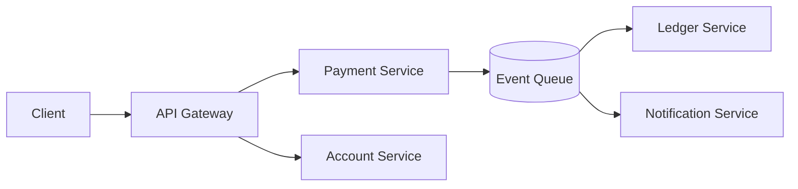
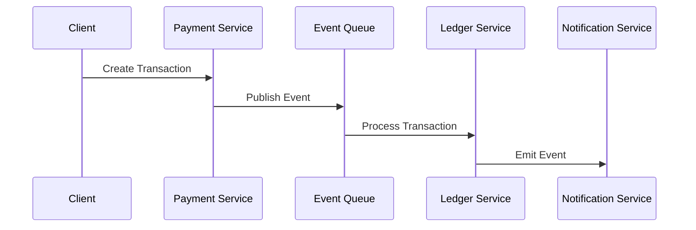

# RFC-002: AEGIS Event Driven Processing Model

**Status: Draft**
**Author: Chirag Venkateshaiah**
Related RFCs: 
- RFC-001 Distributed Platform Architecture
- RFC-002 Event Driven Processing Model
---

## 1. Purpose

The RFC defines the service boundaries and domain model of the AEGIS platform.

It establishes how the system is decomposed into independently deployable services, each aligned with a specific business capability and data ownership model

---

## 2. Scope

This RFC covers:

- service decomposition strategy
- domain boundaries
- data ownership model
- inter-service communication
- anti-patterns and constraints

---

## 3. Design Principles

### 3.1 Domain-Oriented Design

Service are defined around business domains, not technical layers.


### 3.2 Single Responsibility per Service

Each service owns:

- one domain
- one data model
- one set of responsibilities

### 3.3 Data Ownership

Each service:

- owns its database
- does not directly access another service's database

### 3.4 Loose Coupling

Service interact via:

- events (preferred)
- APIs (when necessary)

---

## 4. High-Level Service Architecture



## 5. Core Domain Service

AEGIS is divided into the following core domains:

### 5.1 Payment Service

#### Responsibility

- accept transaction requests
- validate input
- initiate transaction events

#### Owns

- transaction requests
- idempotency keys

#### Does NOT

- update ledger directly

### 5.2 Account Service

#### Responsibility

- manage account lifecycle
- provide account metadata

#### Owns

- account profiles
- account state (non-financial)

### 5.3 Ledger Service (Critical Domain)

#### Responsibility

- maintain financial correctness
- update balances
- store transaction history

#### Owns

- ledger entries
- account balances

#### Constraints

- must be strongly consistent internally
- must be idempotent

### 5.4 Notification Service

#### Responsibility

- notify users of transaction results

#### Owns

- notification state
- delivery logs

## 6. Domain Interaction Model



## 7. Data Ownership Model

Each service owns its own datastore.

| Service              | Data Owned           |
| -------------------- | -------------------- |
| Payment Service      | transaction requests |
| Account Service      | account metadata     |
| Ledger Service       | balances, ledger     |
| Notification Service | notifications        |

### Rule: No Shared Database

This is critical.

- No cross-service DB access
- No shared schema

> All communication via events/APIs

---

## 8. API vs Event Communication

| Communication Type | Use Case            |
| ------------------ | ------------------- |
| API                | synchronous queries |
| Event              | state changes       |

Example

- Payment ➡ Ledger ➡ Event
- Account lookup ➡ API call

---

## 9. Service Boundaries Rationale

Why this decomposition?

### Payment vs Ledger separation

- prevents double writes
- isolates financial correctness

### Ledger isolation

- critical system = strict control
- avoids corruption

---

## 10. Anti-Pattern Avoided

### Distributed Monolith

Symptoms:

- shared DB
- tightly coupled services

### God Service

Avoid:

- one service doing everything

### Synchronous Chains

Avoid:

```bash
API → Service A → Service B → Service C
```
Leads to:

- cascading failures

---

## 11. Scaling Model

Each service scales independently:

| Service         | Scaling Strategy   |
| --------------- | ------------------ |
| Payment         | API scaling        |
| Ledger          | controlled scaling |
| Worker Services | horizontal scaling |
| Notification    | burst scaling      |

## 12. Failure Isolation

Failures are contained:

- Payment failure ➡ no ledger corruption
- Notification failure ➡ no transaction loss
- Worker failure ➡ retriable

## 13. Consistency Model Across Domains

| Domain | Consistency |
| ------ | ----------- |
| Ledger | Strong      |
| Others | Eventual    |

## 14. Security Boundaries

Each service enforces:

- authentication
- authorization
- service-level access control

---

## 15. Evolution Strategy

Future service may include:

- Fraud Detection Service
- Audit Service
- Analytics Pipeline

## 16. Decision

AEGIS adopts a domain-oriented microservices architecture with strict data ownership and event-driven interaction.

## 17. Consequences

### Pros

- clear ownership
- scalable services
- fault isolation

### Cons

- distributed complexity
- cross-service debugging

---

## 18. Future Work

- service contracts (API specs)
- schema registry
- domain event catalog
- services SLAs

